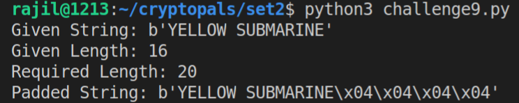

# Set 2: 9:16

# 9 Implement PKCS#7 padding

## 9.1 Intro

The task here is to pad a given text so that its length is of the desired length, using the PKCS#7 padding scheme. In this scheme, `n` number of bytes are padded `n` number of times so that the length of the given text matches the desired length. For example, if the text is `hello, world`and the desired block length is `16` bytes (as is often the case), then we need to pad this text with `4` bytes because the given text only has `12` bytes and the target length is `16`. Now, since we need to pad with `4` bytes, we pad the byte `\x04`, `4` times on to the end of the string so that the resulting string is: `hello, world\x04\x04\x04\x04`.

## 9.2 Code

```python
def pad(text, size):
    """pads text to make it of size `size`,
    according to the PKCS#7 padding scheme

    Args:
        text (bytes): the text to pad
        size (int): required size of padded string

    Returns:
        bytes: the padded string with size = `size`
    """
    length = len(text)
    if length % size == 0:
        return text
    
    padding = size - (length % size)
    padValue = hex(padding).lstrip('0x')
    if len(padValue) == 1:
        padValue = '0' + padValue # bytes can't convert single digit hex
    padValue = bytes.fromhex(padValue)

    paddedString = text + padValue * padding

    return paddedString

def main():

    given = b'YELLOW SUBMARINE'
    requiredLength = 20 # say
    paddedString = pad(given, requiredLength)

    print(f"Given String: { given }")
    print(f"Given Length: { len(given) }")
    print(f"Required Length: { requiredLength }")
    print(f"Padded String: { paddedString }")

if __name__ == "__main__":
    main()
```

## 9.3 Output



# 10 Implement CBC Mode

## 10.1 Intro

The task for this challenge is to implement `AES-128` in `CBC` mode. 

The Cipher Block Chaining (CBC) mode improves upon the `ECB` mode by removing its flaw of lack of diffusion. In this mode, same block of text returns different ciphertexts based on the position of the block within the plaintext. This is accomplished by using the `XOR` operation on the plaintext block and the *previous* *encrypted* block. For the first block, where the *previous block* does not exist, a special block of bytes, known as the *initialization vector,* is used. The complete block diagram is shown below:


The CBC Encryption Block Diagram


The CBC Decryption Block Diagram

## 10.2 Code

Custom Library Used: [aes_cbc](https://gist.github.com/e12ce3cd782d064ec4390f46fd20c291)

```python
from base64 import b64decode
import os
from utils.aes_cbc import cbc

def main():

    directory = 'files' 
    filename = '10.txt'
    path = os.path.join(directory, filename)

    with open(path, 'r') as f:
        lines = f.readlines()

    length = len(lines)
    for i in range(length):
        lines[i] = lines[i].rstrip()
    
    ciphertext = ''.join(lines)
    ciphertext = b64decode(ciphertext)

    key = b'YELLOW SUBMARINE'
    AES = cbc(key)
    
    plaintext = AES.decrypt(ciphertext)
    print(plaintext)

if __name__ == "__main__":
    main()
```

## 10.3 Output


The decrypted text in bytes, a padding of 4 bytes can be seen at the end.

# 11. An ECB/CBC Detection Oracle

## 11.1 Intro

In this challenge, we are required to detect whether a given cipher text was encrypted using AES in ECB mode or CBC mode. But before implementing this, we are to implement an `encryption_oracle` function that encrypts a piece of plain-text using AES in ECB mode 50% of the time and in CBC mode the other 50%.

Underneath the hood, the `encryption_oracle` function does the following:

1. Generates a random 16-byte key.
2. Pads both ends of the plain-text with 5-10 (count chosen at random) bytes of random values.
3. Encrypts the padded plain-text using AES in CBC or ECB mode with equal probability.

As the plain-text has to have a length that is a multiple of 16, we need to pad the plain-text after step (2) to ensure that the encryption takes place properly.

The way we can detect the mode of encryption from the cipher-text is to see if there are any repeated blocks of text inside the cipher-text. If there are repeated blocks, the encryption mode must be ECB. This is based on the fact that in ECB mode, the same block of plain-text always produces the same block of cipher-text regardless of their relative locations inside the cipher-text. So, this detection scheme is able to detect ECB mode if the plain-text contains repeated blocks of text. By contrast, an absence of such repeated blocks means that the `encryption_oracle` encrypted the plain-text using AES in CBC mode.

## 11.2 Code

```python
from Crypto.Cipher import AES
from random import Random

def random_key(length):
    """generates a random string `length` bytes in length

    Args:
        length (int): the length of the random string to generate

    Returns:
        str: a byte-string `length` bytes in length
    """
    key = b''
    choices = list(range(256))
    for i in range(length):
        choice = Random().choice(choices)
        hexVal = hex(choice).lstrip('0x')
        if len(hexVal) % 2 != 0:
            hexVal = '0' + hexVal
        key += bytes.fromhex(hexVal)

    if len(key) % length != 0:
        key += bytes(length - len(key) % length) # just in case the key is not `length` bytes in length (due to escape characters)
    return key

def pad(msg):
    """pads the `msg` byte-string with 5-10 random bytes on both ends, and then PKCS#7 padding

    Args:
        msg (bytes): a byte-string that is to be padded

    Returns:
        bytes: the padded byte-string
    """
    leftPadCnt = Random().randint(5, 10)
    rightPadCnt = Random().randint(5, 10)
    leftPad = random_key(leftPadCnt)
    rightPad = random_key(rightPadCnt)

    paddedMsg = leftPad + msg + rightPad 

    size = 16
    length = len(paddedMsg)
    if length % size == 0:
        return paddedMsg
    
    # PKCS#7 padding if the plain-text after padding isn't a multiple of AES.BLOCK_SIZE
    padding = size - (length % size)
    padValue = hex(padding).lstrip('0x')
    if len(padValue) == 1:
        padValue = '0' + padValue # bytes can't convert single digit hex
    padValue = bytes.fromhex(padValue)
    paddedMsg += padValue * padding

    return paddedMsg
    

def encryption_oracle(msg):
    """encrypts `msg` using AES in CBC/ECB alternatively with equal probability

    Args:
        msg (bytes): byte-string

    Returns:
        [bytes]: the byte-string of encrypted text
    """
    mode = Random().randint(0, 1)
    key = random_key(16)
    print(f"Key: { key }")
    paddedMsg = pad(msg)

    if mode:
        print("Chose ECB Mode")
        cipher = AES.new(key, AES.MODE_ECB)
        ciphertext = cipher.encrypt(paddedMsg)
    else:
        print("Chose CBC Mode")
        iv = random_key(16)
        cipher = AES.new(key, AES.MODE_CBC, iv)
        ciphertext = cipher.encrypt(paddedMsg)

    return ciphertext

def detect(cipher):
    """detects whether the cipher-text was encrypted in ECB or CBC mode

    Args:
        cipher (bytes): byte-string of cipher-text

    Returns:
        str: "EBC" | "CBC"
    """
    chunkSize = 16
    chunks = []
    for i in range(0, len(cipher), chunkSize):
        chunks.append(cipher[i:i+chunkSize])

    uniqueChunks = set(chunks)
    if len(chunks) > len(uniqueChunks):
        return "ECB"

    return "CBC"

def main():
    msg = b"Yellow SubmarineTwo One Nine TwoYellow Submarine" * 2
    ciphertext = encryption_oracle(msg) 
    print(f"Detected: { detect(ciphertext) } mode")

if __name__ == "__main__":
    main
```

## 11.3 Output


Consecutive Runs showing Modes chosen and corresponding Detection

# 12 Byte-at-a-time ECB decryption (Simple)

## 12.1 Intro

The objective for this challenge is to decipher an `UNKNOWN_STRING` encrypted using `ECB` mode of `AES` using a fixed block size and an unknown but consistent key across blocks/iterations. For this purpose, we shall use the `byte-at-a-time` approach.

## 12.2 Setup

First of all, we must create the `oracle` function that performs the encryption for us. As per the specifications, the oracle function does the following:

1. Appends the following `base64` encoded `UNKNOWN_STRING` after decoding to the message being encrypted:

    ```
    Um9sbGluJyBpbiBteSA1LjAKV2l0aCBteSByYWctdG9wIGRvd24gc28gbXkg
    aGFpciBjYW4gYmxvdwpUaGUgZ2lybGllcyBvbiBzdGFuZGJ5IHdhdmluZyBq
    dXN0IHRvIHNheSBoaQpEaWQgeW91IHN0b3A/IE5vLCBJIGp1c3QgZHJvdmUg
    YnkK
    ```

2. A `KNOWN_STRING` can be sent to the `oracle()` function which then appends the `UNKNOWN_STRING` (after decoding) to the `KNOWN_STRING`, and then encrypts it using `AES-ECB` of fixed `block-size` and `KEY`. As the size of the concatenated string might not be a multiple of `block_size`, the `oracle()` also applies a `PKCS#7` padding.
3. The `KEY` chosen by the oracle is random but consistent. This means that over successive runs of the program, the function uses different keys. But within a single run, the value of the key does not change.

The result is a function that does the following:

```
oracle(KNOWN_STRING) => AES-ECB(KNOWN_STRING + base64_decoded(UNKNOWN_STRING), KEY)
```

## 12.3 Algorithm

1. First, we must detect the `block_size` used by the `oracle()`. For this, we must remember that the padding scheme used by the `oracle()` function is the `PKCS#7`. This means that as the length of the `plaintext` increases, so does the padding and hence, the size of the `ciphertext`.

    For example, consider the following pseudocode:

    ```jsx
    let block_size = 4;

    /* Case 1 */
    plaintext = 'h'; // size != block_size => padding = 'x03x03x03'
    ciphertext = AES_ECB(plaintext); // size = block_size

    /* Case 2 */
    plaintext = 'he'; // size != block_size => padding = 'x02x02'
    ciphertext = AES_ECB(plaintext); // size = block_size

    /* Case 3 */
    plaintext = 'hel'; // size != block_size => padding = 'x01'
    ciphertext = AES_ECB(plaintext); // size = block_size

    /* Case 4 */ 
    plaintext = 'hell'; // size = block_size => no padding
    ciphertext = AES_ECB(plaintext); // size = block_size

    /* Case 5 */
    plaintext = 'hello'; // size != block_size => padding = 'x03x03x03'
    ciphertext = AES_ECB(plaintext); // size = block_size * 2
    ```

    Thus, we can see that the length of the `ciphertext` remains unchanged for cases `1` through `4` but when one more character is added in `case 5`, the size of the `ciphertext` changes by a value that is equal to `block_size`. 

    So, the trick is here to increase the size of the `plaintext` until the length of the `ciphertext` increases by more than `1` or simply changes. The amount by which the length changes gives us the value of `block_size`.

2. Next, we must detect the `mode` that the `AES` encryption is being operated in in the `oracle()`. This can be done just like in the [previous challenge](https://www.notion.so/Set-2-9-16-c9a8c20ea15d46b0928ebf2207f29cf5#0634745be00841c48e0422c59c990e42).
3. Now come the actual decryption steps. We shall decrypt the `plaintext` one byte at a time. Let us first consider the process of decrypting the first character in the `plaintext`:

    ```jsx
    let block_size = 4;
    let UNKNOWN_STRING = b'hell'; // this is not known to us

    // we first take a known character (say, 'A') block_size - 1 times
    known = b'AAA';

    // we pass `known` to the oracle() function that prepends it to the UNKNOWN_STRING
    cipher = oracle(known);
    /*
    * inside the oracle function, `AAAhell` is being encrypted
    * block 1 of this encryption is: AAAh
    * block 2 of this encryption is: ellx01
    * obviously, we only know the first three characters in block 1
    * as each block is encrypted independently in AES_ECB, this is enough information
    */

    // now we test what character at position 3 (0-indexed) in block 1
    // gets us the same value as in `cipher`.
    for i := 0 to 256:
    	text = known + to_byte(i);
    	encrypted = oracle(text);
    	// check if oracle('AAA<to_byte(i)>') == oracle('AAA<UNKNOWN>')
    	if first_four_bytes_of(encrypted) == first_four_bytes_of(cipher):
    		print("First character: ", to_byte(i));
    		break;
    ```

    In this way, by brute-forcing and comparing with the actual result i.e., `cipher`, we can detect the first character.

4. For the rest of the characters in the first block of `plaintext`, we must replace the right-most `A` with the character that has just been discovered, and so decrease the number of `A`'s when computing the `cipher`. Here is the pseudocode:

    ```jsx
    let plaintext = b'';
    while length_of(plaintext) < block_size:
    	// as more characters in plaintext are discovered, the size of `known` decreases
    	length = block_size - 1 - length_of(plaintext);
    	known = b'A' * length;
    	cipher = oracle(known);

    	for i := 1 to 256:
    		// 'AAA' + '' + 'h' => 'AA' + 'h' + 'e' => 'A' + 'he' + 'l' => '' + 'hel' + 'l'
    		text = known + plaintext + to_byte(i);
    		encrypted = oracle(text);
    		if first_four_bytes_of(encrypted) == first_four_bytes_of(cipher):
    			plaintext += to_byte(i);
    			break;
    ```

5. For the next block, we carry out a similar process but along with the `A`'s we also prepend the value of the known `plaintext`, and we must check for more than just the first four bytes.

    Consider the following pseudocode:

    ```jsx
    let UNKNOWN_STRING = b'hellfire' // this is not known to us
    let plaintext = b'';
    let block = 1;

    while true:
    	length = block_size - 1 - length_of(plaintext) % block_size;
    	known = b'A' * length;
    	// 'AAA' + 'hellfire' => 'AA' + 'hellfire' => 'A' + 'hellfire' => ...
    	// 'AAAhellfire' => 'AAhellfire' => 'Ahellfire' => 'hellfire'
    	cipher = oracle(known);
    	// if block being inspected exceeds length of cipher, we must exit
    	if block * block_size > length_of(cipher):
    		print(plaintext);
    		break;
    	
    	let found = true;
    	for i := 1 to 256:
    		// 'AAA' + 'hell' + 'f' => 'AA' + 'hellf' + 'i' => 'A' + 'hellfi' + 'r' => ...
    		// 'AAAhellf' => 'AAhellfi' => 'Ahellfir' => 'hellfire'
    		text = known + plaintext + to_byte(i);
    		encrypted = oracle(text)[:block*block_size];
    		if encrypted == cipher[:block*block_size]:
    			plaintext += to_byte(i);
    			if length_of(plaintext) % block_size == 0:
    				block += 1;
    			found = true;
    			break;
    	// if no matches exist, we could have reached the end
    	if !found:
    		print(plaintext)
    		break
    ```

    The above code returns the plaintext.

## 12.4 Code

The code below implements the steps mentioned above in `python`. The brute-force approach has been optimized by checking for alphanumeric characters and spaces first.

```python
from base64 import b64decode
from Crypto import Random 
from Crypto.Cipher import AES

UNKNOWN_STRING = b"""
Um9sbGluJyBpbiBteSA1LjAKV2l0aCBteSByYWctdG9wIGRvd24gc28gbXkg
aGFpciBjYW4gYmxvdwpUaGUgZ2lybGllcyBvbiBzdGFuZGJ5IHdhdmluZyBq
dXN0IHRvIHNheSBoaQpEaWQgeW91IHN0b3A/IE5vLCBJIGp1c3QgZHJvdmUg
YnkK"""
# b"Rollin' in my 5.0\nWith my rag-top down so my hair can blow\nThe girlies on standby waving just to say hi\nDid you stop? No, I just drove by\n" 

KEY = Random.new().read(16)

def pad(your_string, msg):
    """prepends the `msg` with `your_string` and then, applies PKCS#7 padding

    Args:
        your_string (bytes): the byte-string to prepend to `msg`
        msg (bytes): a byte-string that is to be padded

    Returns:
        bytes: the padded byte-string
    """
    paddedMsg = your_string + msg

    size = 16
    length = len(paddedMsg)
    if length % size == 0:
        return paddedMsg
    
    # PKCS#7 padding if the plain-text after padding isn't a multiple of AES.BLOCK_SIZE
    padding = size - (length % size)
    padValue = bytes([padding])
    paddedMsg += padValue * padding

    return paddedMsg
    

def encryption_oracle(your_string):
    """encrypts `your_string` + msg` + `UNKNOWN_STRING` using AES-ECB-128

    Args:
        your_string (bytes): byte-string used to prepend

    Returns:
        [bytes]: the byte-string of encrypted text
    """
    msg = bytes('The unknown string given to you was:\n', 'ascii')
    # append the `UNKNOWN_STRING` given to us to the `msg`
    plaintext = msg + b64decode(UNKNOWN_STRING)
    # add `your_string` to prepend to `plaintext` and apply `PKCS#7` padding to correct size
    paddedPlaintext= pad(your_string, plaintext)

    cipher = AES.new(KEY, AES.MODE_ECB)
    ciphertext = cipher.encrypt(paddedPlaintext)

    return ciphertext

def detect_block_size():
    """detects the `block_size` used by the encryption_oracle()

    Returns:
        int: the `block_size` used by the encryption_oracle
    """
    feed = b"A"
    length = 0
    while True:
        cipher = encryption_oracle(feed)
        # on every iteration, add one more character
        feed  += feed
        # if the length of the ciphertext increases by more than 1,
        # PKCS#7 padding must have been added to make the size of plaintext == block_size
        # increase in the size gives the value of block_size
        if not length == 0 and len(cipher) - length > 1:
            return len(cipher) - length
        length = len(cipher)
        

def detect_mode(cipher):
    """detects whether the cipher-text was encrypted in ECB or not

    Args:
        cipher (bytes): byte-string of cipher-text

    Returns:
        str: "ECB" | "not ECB"
    """
    chunkSize = 16
    chunks = []
    for i in range(0, len(cipher), chunkSize):
        chunks.append(cipher[i:i+chunkSize])

    uniqueChunks = set(chunks)
    if len(chunks) > len(uniqueChunks):
        return "ECB"
    return "not ECB"

def ecb_decrypt(block_size):
    """decrypts the plaintext (without key) using byte-at-a-time attack (simple)

    Args:
        block_size (int): the `block_size` used by the `encryption_oracle()` for encryption
    """
    # common = lower_cases + upper_cases + space + numbers
    # to optimize brute-force approach
    common = list(range(ord('a'), ord('z'))) + list(range(ord('A'), ord('Z'))) + [ord(' ')] + list(range(ord('0'), ord('9')))
    rare = [i for i in range(256) if i not in common]
    possibilities = bytes(common + rare)
    
    plaintext = b'' # holds the entire plaintext = sum of `found_block`'s
    check_length = block_size

    while True:
        # as more characters in the block are found, the number of A's to prepend decreases
        prepend = b'A' * (block_size - 1 - (len(plaintext) % block_size))
        actual = encryption_oracle(prepend)[:check_length]

        found = False
        for byte in possibilities:
            value = bytes([byte])
            your_string = prepend + plaintext + value
            produced = encryption_oracle(your_string)[:check_length]
            if actual == produced:
                plaintext += value
                found = True
                break
        
        if not found:
            print(f'Possible end of plaintext: No matches found.')
            print(f"Plaintext: \n{ plaintext.decode('ascii') }")
            return
        
        if len(plaintext) % block_size == 0: 
            check_length += block_size
    

def main():
    # detect block size
    block_size = detect_block_size()
    print(f"Block Size is { block_size }")

    # detect the mode (should be ECB)
    repeated_plaintext = b"A" * 50
    cipher = encryption_oracle(repeated_plaintext)
    mode = detect_mode(cipher)
    print(f"Mode of encryption is { mode }")

    # decrypt the plaintext inside `encryption_oracle()`
    ecb_decrypt(block_size)

if __name__ == "__main__":
    main()
```

## 12.5 Output


Block size used by AES, Mode used by Oracle and the Decrypted Plaintext

# 13 ECB Cut-and-Paste

## 13.1 Intro

In this challenge, we are required to implement a function called `profile_for()` that take an email address and does the following:

1. Converts the email into the format: 

    ```
    email=<value>&uid=<value>&role=user
    ```

2. To ensure that the input is "safe", all `&` and `=` are removed from the user input for email address.
3. The encoded user info is then encrypted with a `key` using `AES-ECB`.

We are also required to create a function that decrypts the encrypted user info to the corresponding user info of the format in (1), and display it in the form of an object like so:

```
{
	email: "foo@bar.com",
	uid: "1",
	role: "user"
}
```

The task it to then, create a user whose `role` is set to `admin`. For this purpose, we must craft a cipher-text which when decrypted by our decryption function generates an object whose `role` value is set to `admin`. In this case, we, the attacker, have access to the encryption key.

## 13.2 Steps

To create the cipher-text with the `role` set to `admin`, we must first note that we are only ever allowed to enter the email address into the `profile_for()` function and any `=` signs are filtered out, so that we cannot simply append `role=admin` into the email address. We must, thus, follow the following steps:

1. As `ECB` encrypts each block of plain-text independently of other blocks, we must first form a cipher-text of the format: `email=user@email.com&uid=1&role=`. These must be contained in one or more cipher blocks and the value of the `role` parameter must be placed in a separate block. We can achieve this by varying the number of letters in the email id.

    For example:

    ```
    0 1 2 3 4 5 6 7 8 9 0 1 2 3 4 5 6 7 8 9 0 1 2 3 4 5 6 7 8 9 0 1
    e m a i l = u s e r @ e m a i l . c o m & u i d = 1 & r o l e =
    ==> 32 charaters
    if the block size used is 16, the above occupies exactly 2 blocks
    The value of role is encrypted separately.

    So, if we set user_input = "user@mail.com",
    and then, encrypt it with encrypted = profile_for(user_input),
    the first two blocks of `encrypted` will decrypt to `email=user@email.com&uid=1&role=`.
    ```

    The above process can be generalized to any block-size.

2. Now, we need to form the part that contains the value `admin`. To do this, we craft another email address which contains `admin` appended to it but occupies its own block. 

    For example:

    ```
    0 1 2 3 4 5 6 7 8 9 0 1 2 3 4 5 | 6 7 8 9 0
    e m a i l = u @ m a i l . c o m | a d m i n
    If the block size is 16, `email=u@mail.com` occupies exactly 1 block,
    while `admin` occupies the next block.
    To let `admin` occupy a whole block, we pad it with PKCS#7 padding.
    In this case, the padding will be of `0x0b`.

    So, if we set user_input = "u@mail.comadmin",
    and then, encrypt it with encrypted = profile_for(user_input)
    the second block of `encrypted` will decrypt to `adminx0bx0bx0bx0bx0bx0bx0bx0bx0bx0bx0b`
    ```

3. Now, we need to concatenate the first two blocks from (1) with the second block from (2). Thus, `cutting-and-pasting` the cipher blocks to form a block that when decrypted forms the `admin` profile. Here, 

    ```
    We are concatenating
    the encrypted form of 
    	`email=user@email.com&uid=1&role=` (blocks 1 and 2 from (1))
    with the encrypted form of
    	`adminx0bx0bx0bx0bx0bx0bx0bx0bx0bx0bx0b` (block 2 from (2))
    so that when the whole text is decrypted we get: 
    	`email=user@email.com&uid=1&role=admin` 
    The padding is removed during decryption
    ```

## 13.3 Code

```python
from collections import OrderedDict
from Crypto.Cipher import AES
from Crypto import Random
import re

USER_DB = OrderedDict()
user_cnt = 0
KEY = Random.new().read(16)

class objectify:
    """class for creating and representing JSON-like objects from a cookie-like object
    """

    def __init__(self, cookie):
        self.cookie = cookie
        self.obj = OrderedDict()

    def convert(self):
        """converts a cookie-like object into a dictionary of key=value pairs

        Returns:
            [dict]: dictionary of key=value pairs 
        """
        # if already converted
        if len(self.obj) > 0:
            return self.obj

        # get key=value pairs
        kv = self.cookie.split('&')
        # assign key=value pairs to dictionary: dict[key]=value
        for pair in kv:
            k, v = pair.split('=')
            self.obj[k] = v
        return self.obj

    def __repr__(self):
        """converts a dictionary of key=value pairs to JSON-like format for representation

        Returns:
            str: a string formatted like a JSON-object
        """
        self.convert()
        ret_value = "{\n"
        last_key = next(reversed(self.obj))
        for key, value in self.obj.items():
            if not key == last_key:
                ret_value += f"\t{ key }: '{ value }',\n"
            else:
                ret_value += f"\t{ key }: '{ value }'\n"
        ret_value += "}"
        return ret_value

def pad(value, size):
    """applies PKCS#7 padding to `value` to make it of size `size`

    Args:
        value (bytes): a byte-string to pad
        size (size): the required size

    Returns:
        bytes: a byte-string = `value` + padding, such that its size is `size`
    """
    if len(value) % size == 0:
        return value
    padding = size - len(value) % size
    padValue = bytes([padding]) * padding
    return value + padValue

def profile_for(user_info):
    """generates an encrypted profile info for the given `user_info`

    Args:
        user_info (str): the email address of the user

    Returns:
        bytes: the AES-ECB encrypted profile info (email, uid, role)
    """

    # get cookie from user_info
    global user_cnt
    user_info = re.sub("&|=", "", user_info) # sanitize the `user_info` to remove '&' and '=' signs
    cookie = f"email={ user_info }&uid={ user_cnt }&role=user"
    user_cnt += 1

    # encrypt the encoded cookie-info
    paddedCookie = pad(bytes(cookie, 'ascii'), AES.block_size) # PKCS#7 padding 
    ecb = AES.new(KEY, AES.MODE_ECB)
    cipherCookie = ecb.encrypt(paddedCookie)

    return cipherCookie

def decrypt_profile(key, cipherCookie):
    """decrypts the encoded ciphertext with the given `key` under AES_ECB

    Args:
        key (bytes): the enryption key of size `AES.block_size`
        cipherCookie (bytes): the encrypted text

    Returns:
        str: the cookie-like object decrypted from the `cipherCookie`
        str: the JSON-like object obtained by parsing the cookie
    """

    # decrypt the `cipherCookie`
    ecb = AES.new(key, AES.MODE_ECB)
    plainCookie = ecb.decrypt(cipherCookie)

    # remove PKCS#7 padding
    last_byte = plainCookie[-1]
    # padding is a numeral whose value ranges from 0 to block_size - 1
    if last_byte in range(AES.block_size - 1):
        padding = bytes([last_byte]) * last_byte
        # check if the `last_byte` number of bytes are the padding bytes
        if plainCookie[-last_byte:] == padding:
            plainCookie = plainCookie[:-plainCookie[-1]]
    
    # parse cookie to object format
    cookie = plainCookie.decode('ascii')
    obj = objectify(cookie) 
    return cookie, str(obj)

def create_admin_profile():
    """creates an `admin profile` given the key for encryption/decryption
    """

    # first create a block so that `email=<x>&uid=<x>&role=` occupies one block_size
    # and value of the role occupies the last block
    cookie_parts = 'email=@gmail.com&uid=2&role='
    username = 'A' * (AES.block_size - len(cookie_parts) % AES.block_size)
    email = username + "@gmail.com"
    cipherCookie1 = profile_for(email)

    # second, create a block so that `admin` occupies a block for itself
    # create an email that occupies one full block
    cookie_param = "email="
    hacker_mail = 'A' * (AES.block_size - len(cookie_param) % AES.block_size)
    # now append 'admin' + 'padding' to the mail so that it occupies a block of its own
    value = pad(b'admin', AES.block_size).decode('ascii')
    hacker_mail += value
    cipherCookie2 = profile_for(hacker_mail)

    # all except the last block of `cipherCookie1` i.e., `email=***@gmail.com&uid=0&role=`
    block1 = cipherCookie1[:-AES.block_size]
    # just the block containing `admin`, here it is the second block 
    block2 = cipherCookie2[AES.block_size:AES.block_size*2]
    # concatenate `block1` and `block2`
    cipherBlock = block1 + block2 

    cookie, obj = decrypt_profile(KEY, cipherBlock)
    print(f"Cookie Created: { cookie }")
    print(f"Object Created: { obj }")

if __name__ == "__main__":
    create_admin_profile()
```

## 13.4 Output


Tricking the `profile_for()` function to create an `admin` profile.

# 14 Byte-at-a-time ECB decryption (Harder)

## 14.1 Intro

The task for this challenge is the same as that for `challenge12` with one key difference that the `oracle()` function now prepends a random count of random bytes to the message to be encrypted, so that the oracle function now looks like the following:

```
oracle(random_bytes + attacker_bytes + target_bytes, random_key)
```

The `random_bytes` are selected at the beginning of the code execution and do not change within the same run-time, just like in the case of the `random-key`. 

For `challenge12`, the strategy was to create a block of text whose size is one less than the block size used by `AES_ECB` and then prepend it to the `target_bytes` as the `attacker_bytes`. This allowed us to brute force the value of the first byte in the plain-text. Now, however, there are additional bytes (`random_bytes`) that the `oracle` function itself prepends to the plain-text and whose size is unknown to us.

As the size of the `random_bytes` is constant, we must first determine this size. Then, we must use this size as the offset for the `attacker_bytes` so that we can craft a block of plain-text whose size is still 1 less than the block size used by `AES_ECB`.

## 14.2 Steps

1. First, we must determine the size of the `random_bytes` being used by the `oracle()` function. We shall do this in two steps: 
    1. Determine the number of complete  blocks occupied by the `random_bytes`.

        We know that each block is encrypted independently in `AES_ECB`, and we know that the `random_bytes` are constant. This means that if the `random_bytes` occupy two complete blocks, then, these blocks will always be encrypted to produce the same block of cipher-text no matter what we send to the `oracle()` as the input argument. 

        **Observation**: The number of cipher blocks that do not change even when changing the input to the `oracle()` function gives us the number of complete blocks occupied by the `random_bytes`.

    2. Determine the left-over number of bytes in the `random_bytes`.

        The left-over  bytes, say `residue`, are those bytes at the end of the `random_bytes` that do not occupy a full block. For example, if the block size used by `AES_ECB` is 4 and the size of `random_bytes` is 10 $(2 \times 4 + 2)$, then `random_bytes` occupies 2 blocks and the remaining 2 bytes are the `residue`.  

        To determine the residue, we first find the number of bytes that need to be added to the cipher-text until a new block (block that is one greater than the number of blocks occupied completely by `random_bytes`; in this case, it is the third block) does not change. This number when subtracted from the block size gives us the value of `residue`. This is illustrated below:

        ```
        let random_bytes = b'abcdefghij' // 10 bytes
        let block_size = 4
        // now let's separate random_bytes into blocks of block_size
        abcd efgh ij
        // this is prepended to a plaintext
        let plaintext = b'yellow'
        // then the following blocks are formed
        **abcd efgh ijye llow**
        // now we can inject attacker bytes between random_bytes and plaintext
        // let's start with an 'a'
        **abcd efgh ijay ello w...**
        // the cipher is the same for the first two blocks, and different for the next 3
        // one more 'a'
        **abcd efgh ijaa yell ow..**
        // the cipher is again the same for the first two blocks, and different for the next 3
        // one more 'a'
        **abcd efgh ijaa ayel low.**
        // this time even the THIRD BLOCK is the same as before (in the cipher)
        // so we needed to add 3 a's so that a new block does not change
        // this means two a's were necessary to form a complete block
        // this means that there were (4-2)=2 characters of `random_bytes` in the third block
        ```

2. The next steps are the same as that for `challenge12` except that we must use the length of the `random_bytes` to offset the number of bytes we must inject as the attacker leaving a room for ONE unknown byte in the plain-text.

    To extend the above example, we discovered that the length of `random_bytes` is `10`. So, we must set `attacker_bytes` to `a` so that in the third block, only the fourth place is filled with an unknown character from the plain-text.

## 14.3 Code

```python
from base64 import b64decode
from Crypto import Random 
from Crypto.Cipher import AES
from random import Random as rand

UNKNOWN_STRING = b"""
Um9sbGluJyBpbiBteSA1LjAKV2l0aCBteSByYWctdG9wIGRvd24gc28gbXkg
aGFpciBjYW4gYmxvdwpUaGUgZ2lybGllcyBvbiBzdGFuZGJ5IHdhdmluZyBq
dXN0IHRvIHNheSBoaQpEaWQgeW91IHN0b3A/IE5vLCBJIGp1c3QgZHJvdmUg
YnkK"""
# b"Rollin' in my 5.0\nWith my rag-top down so my hair can blow\nThe girlies on standby waving just to say hi\nDid you stop? No, I just drove by\n" 

KEY = Random.new().read(16)
prefix_length = rand().randint(1, 3 * AES.block_size) # can occupy at most three blocks (this is arbitrary)
PREFIX = Random.new().read(prefix_length)

def pad(msg):
    """prepends the `msg` with `your_string` and then, applies PKCS#7 padding

    Args:
        your_string (bytes): the byte-string to prepend to `msg`
        msg (bytes): a byte-string that is to be padded

    Returns:
        bytes: the padded byte-string
    """
    paddedMsg = msg
    size = 16
    length = len(paddedMsg)
    if length % size == 0:
        return paddedMsg
    
    # PKCS#7 padding if the plain-text after padding isn't a multiple of AES.BLOCK_SIZE
    padding = size - (length % size)
    padValue = bytes([padding])
    paddedMsg += padValue * padding

    return paddedMsg
    

def encryption_oracle(your_string):
    """encrypts `your_string` + msg` + `UNKNOWN_STRING` using AES-ECB-128

    Args:
        your_string (bytes): byte-string used to prepend

    Returns:
        [bytes]: the byte-string of encrypted text
    """
    msg = bytes('The unknown string given to you was:\n', 'ascii')
    # append the `UNKNOWN_STRING` given to us to the `msg`, prepend `your_string` and then, the `PREFIX`
    plaintext = PREFIX + your_string + msg + b64decode(UNKNOWN_STRING)
    # Apply `PKCS#7` padding to correct size
    paddedPlaintext= pad(plaintext)

    cipher = AES.new(KEY, AES.MODE_ECB)
    ciphertext = cipher.encrypt(paddedPlaintext)

    return ciphertext

def detect_block_size():
    """detects the `block_size` used by the encryption_oracle()

    Returns:
        int: the `block_size` used by the encryption_oracle
    """
    feed = b"A"
    length = 0
    while True:
        cipher = encryption_oracle(feed)
        # on every iteration, add one more character
        feed  += feed
        # if the length of the ciphertext increases by more than 1,
        # PKCS#7 padding must have been added to make the size of plaintext == block_size
        # increase in the size gives the value of block_size
        if not length == 0 and len(cipher) - length > 1:
            return len(cipher) - length
        length = len(cipher)
        

def detect_mode(cipher):
    """detects whether the cipher-text was encrypted in ECB or not

    Args:
        cipher (bytes): byte-string of cipher-text

    Returns:
        str: "ECB" | "not ECB"
    """
    chunkSize = 16
    chunks = []
    for i in range(0, len(cipher), chunkSize):
        chunks.append(cipher[i:i+chunkSize])

    uniqueChunks = set(chunks)
    if len(chunks) > len(uniqueChunks):
        return "ECB"
    return "not ECB"

def detect_prefix_length():
    """Detects the length of the prefix used in the oracle

    Returns:
        int: the length of the prefix
    """
    block_size = detect_block_size()

    # first find number of integer blocks occupied
    test_case_1 = encryption_oracle(b'a')
    test_case_2 = encryption_oracle(b'b')

    length1 = len(test_case_1)
    length2 = len(test_case_2)

    blocks = 0
    min_length = min(length1, length2)
    # if the any of the blocks (starting from the left) are the same,
    # these blocks are occupied by the `PREFIX`
    for i in range(0, min_length, block_size):
        if test_case_1[i:i+block_size] != test_case_2[i:i+block_size]:
            break
        blocks += 1

    # now calculate the residual number of bytes and add to total size 
    test_input = b''
    length = blocks * block_size
    # if adding an extra `?` does not change the current block of cipher-text
    # we've reached the end of that block, and so,
    # we've found the number of extra characters needed to complete the block with some prefix characters
    for extra in range(block_size):
        test_input += b'?'
        curr = encryption_oracle(test_input)[length: length+block_size]
        next = encryption_oracle(test_input + b'?')[length: length+block_size] 
        if curr == next:
            break
    
    residue = block_size - len(test_input)
    length += residue
    return length 

def ecb_decrypt(block_size):
    """decrypts the plaintext (without key) using byte-at-a-time attack (simple)

    Args:
        block_size (int): the `block_size` used by the `encryption_oracle()` for encryption
    """
    # common = lower_cases + upper_cases + space + numbers
    # to optimize brute-force approach
    common = list(range(ord('a'), ord('z'))) + list(range(ord('A'), ord('Z'))) + [ord(' ')] + list(range(ord('0'), ord('9')))
    rare = [i for i in range(256) if i not in common]
    possibilities = bytes(common + rare)
    
    plaintext = b'' # holds the entire plaintext = sum of `found_block`'s
    check_length = block_size
    
    prefix_len = detect_prefix_length()
    print(f"Calculated Length of Prefix = { prefix_len }")
    check_begin = (prefix_len // block_size) * block_size
    residue = prefix_len % block_size

    while True:
        # as more characters in the block are found, the number of A's to prepend decreases
        prepend = b'A' * (block_size - 1 - (len(plaintext) + residue) % block_size)
        actual = encryption_oracle(prepend)[check_begin: check_begin+check_length]

        found = False
        for byte in possibilities:
            value = bytes([byte])
            your_string = prepend + plaintext + value
            produced = encryption_oracle(your_string)[check_begin: check_begin+check_length]
            if actual == produced:
                plaintext += value
                found = True
                break
        
        if not found:
            print(f'Possible end of plaintext: No matches found.')
            print(f"Plaintext: \n{ plaintext.decode('ascii') }")
            return
        
        if (len(plaintext) + residue) % block_size == 0: 
            check_length += block_size
    

def main():

    # detect block size
    block_size = detect_block_size()
    print(f"Block Size is { block_size }")

    # detect the mode (should be ECB)
    repeated_plaintext = b"A" * 50
    cipher = encryption_oracle(repeated_plaintext)
    mode = detect_mode(cipher)
    print(f"Mode of encryption is { mode }")

    # actual length of prefix
    print(f"Actual size of prefix = { len(PREFIX) }")

    # decrypt the plaintext inside `encryption_oracle()`
    ecb_decrypt(block_size)

if __name__ == "__main__":
    main()
```

## 14.4  Output


Output for the code given in 14.3

# 15 PKCS#7 padding validation

## 15.1 Intro

The task in this challenge is to determine if the padding applied to the given plain-text is valid according to PKCS#7 padding scheme. The scheme has already been explained in `challenge 9`.

To check this, we must ensure that valid characters have been used for padding and the length of the padding is valid.

## 15.2 Code

```python
def valid_padding(paddedMsg, block_size):
    """checks if `paddedMsg` has valid PKCS#7 padding for given `block_size`

    Args:
        paddedMsg (bytes): the padded text
        block_size (int): the block size that is to be obtained by padding

    Returns:
        bool: True, if the padding is valid. False, otherwise. 
    """
    # if the length of the `paddedMsg` is not a multiple of `block_size`
    if len(paddedMsg) % block_size != 0:
        return False
    
    last_byte = paddedMsg[-1] 

    # if the value of the last_byte is greater than or equal to block_size
    if last_byte >= block_size:
        return False
    
    padValue = bytes([last_byte]) * last_byte
    # if all the padding bytes are not the same
    if paddedMsg[-last_byte:] != padValue:
        return False
    
    # if, after removing the padding, the remaining characters are not all printable
    if not paddedMsg[:-last_byte].decode('ascii').isprintable():
        return False
    
    return True

def remove_padding(paddedMsg, block_size):
    """removes padding from `paddedMsg`, displays error-message if padding is invalid

    Args:
        paddedMsg (bytes): the message that is padded using PKCS#7 padding
        block_size (int): the block size that is obtained by said padding

    Raises:
        ValueError: if the padding is invalid and then, shows an error message
    """ 
    try:
        if not valid_padding(paddedMsg, block_size):
            raise ValueError
    except ValueError:
        print(f"{ paddedMsg } has invalid PKCS#7 padding.")
        return
    
    last_byte = paddedMsg[-1]
    unpadded = paddedMsg[:-last_byte]
    print(f"Padding removed successfully...")
    print(f"Before padding removal: { paddedMsg }")
    print(f"After padding removal: { unpadded }")

def test():
    """tests the `remove_padding()` function for various test cases.
    """

    block_size = 16

    # Test case 1: incorrect value < required:
    paddedMsg = b'ICE ICE BABY\x03\x03\x03\x03'
    remove_padding(paddedMsg, block_size)

    # Test caes 2: incorrect value > required:
    paddedMsg = b"ICE ICE BABY\x05\x05\x05\x05" 
    remove_padding(paddedMsg, block_size)

    # Test case 3: incorrect length:
    paddedMsg = b"ICE ICE BABY\x04\x04\x04"
    remove_padding(paddedMsg, block_size)

    # Test case 4: variable numbers:
    paddedMsg = b"ICE ICE BABY\x01\x02\x03\x04"
    remove_padding(paddedMsg, block_size)

    # Test case 5: correct padding 
    paddedMsg = b"ICE ICE BABY\x04\x04\x04\x04"
    remove_padding(paddedMsg, block_size)

if __name__ == "__main__":
    test()
```

## 15.3 Output


Output of function that checks if the padding is valid according to the PKCS#7 scheme.

# 16 CBC bitflipping attacks

## 16.1 Intro

The task for this challenge is to craft a cipher-text which decrypts to contain the string `;admin=true;`. The caveat is that the function that encrypts uses `AES` in `CBC` mode and quotes out any `=` or `&` characters, essentially replacing them with some other character or characters. Meanwhile, the key is not known to us, and the encryption function adds some prefix and some suffix to the input we supply to it. Thus, the encryption function looks like this:

```python
  encryption_oracle(prefix + input_string + suffix, key)
```

According to the specifications, the values for prefix and suffix are:

```python
prefix = b"comment1=cooking%20MCs;userdata="
suffix = b";comment2=%20like%20a%20pound%20of%20bacon"
```

The size of the prefix can be defined in the same way as in Challenge 14. So, in this challenge, we shall focus only on the procedure to forge the required cipher-text given that we know the length of the prefix (which in this case is 32, exactly 2 `AES-128` block lengths).

## 16.2 Background

To understand the procedure, we must first understand the decryption process used by the `CBC` mode and the curious property of the `xor` operation.

The block diagram for `CBC` decryption is as follows:


As we can see, each block of cipher-text is `XOR`'d with the next AES-decrypted cipher-block to get the next block of plain-text. As we already know the cipher-text and the target plain-text, we can exploit this.

Consider the following:

$$C_n^i= Cipher \space Byte \space of \space block \space \underline{n} \space at \space position \space \underline{i} \\ C_{n+1}^{i} = Cipher \space Byte \space of \space block \space (\underline{n+1}) \space at \space position \space \underline{i} \space just \space before \space XOR\\ P_{n+1}^i = The \space Target \space Plaintext \space Byte \space of \space block \space (\underline{n+1}) \space at\space position \space \underline{i} \space after \space XOR$$

Then, we know:

$$C_n^i \oplus C_{n+1}^i = P_{n+1}^i\\ \implies C_n^i =  P_{n+1}^i \oplus C_{n+1}^i$$

Thus, we can inject any value $C_n^i$ at the right position to get the required target byte. However, we must first find the value of $C_{n+1}^i$ as this is not known to us. This can be easily computed as:

$$C_{n+1}^i = P_{n+1}^i \oplus C_n^i$$

In this context, $C_n^i$ is the original (untampered) cipher-text byte. Also, note that the `xor` operation takes place at bit level.

So, the target cipher-text to be injected at the specified position is given by:

$$C_{n+1, inject}^i = P_{n+1, target}^i \oplus P_{n+1, orig.} \oplus C_{n, orig.}^i$$

For example:

```
Given ciphertext = ax5A dg74
Actual plaintext = hell oeen
Target plaintext = hell oben

We need 'b' in position 2 of block 2 where there was previously 'e'.
Then, we would simply change the 2nd position of block 1 from 'x' to:
	target xor original_plain xor original_cipher
=> b'b' xor b'e' xor b'x'
```

This change scrambles up the plain-text in the block where we have replaced the bytes, but yields the desired result in the next block.

## 16.3 Exploit

For the current exploit, the target bytes are `;admin=true;`. Armed with the knowledge from the above background, we can do this in a couple of ways. One way would be to change the `prefix` bytes. But we are not going to do that, mainly because the prefix bytes allow for debugging when we decrypt the *crafted* cipher-text. Instead, we are going to encrypt two cipher-blocks of an arbitrary character such as `A`. This means that our input to the `encryption_oracle()` will be `b'A' * 16 * 2`. We will change the first of these blocks and produce the target bytes in the second one.

To that end, we first `xor` the target bytes i.e., `;admin=true;` with `AAAAAAAAAAA`, to produce some gibberish and then, pad it so that it occupies one block. We add zeros before and after this so that total length is the same as the original ciphertext. This allows us to `xor` the target bytes with the corresponding cipher-text without altering the rest of the bytes.

Illustration:

```
let target bytes be 'abcd'
let prefix bytes be 'pppp' (after encryption = 'qqqq')
let suffix bytes be 'ssss' (after encryption = 'tttt')
let input  bytes be 'aaaa aaaa' (after encryption = 'bbbb bbbb')
let result of xor of 'abcd'(target) with 'bbbb'(correspondig ciphertext) be 'xxxx'
====================================================================================
cipher-text   : qqqq bbbb bbbb tttt
injected      : 0000 xxxx 0000 0000 (0's added around 'xxxx')
after xor     : qqqq zzzz bbbb tttt (z's are the values we needed to inject)
on decryption : pppp ???? abcd ssss ('????' are most likely gibberish, but we got the 'abcd')
```

## 16.4 Code

```python
from Crypto.Cipher import AES
from Crypto import Random
import re

def pad(value, size):
    """applies PKCS#7 padding to `value` to make it of size `size`

    Args:
        value (bytes): a byte-string to pad
        size (size): the required size

    Returns:
        bytes: a byte-string = `value` + padding, such that its size is `size`
    """
    if len(value) % size == 0:
        return value
    padding = size - len(value) % size
    padValue = bytes([padding]) * padding
    return value + padValue

class InvalidPaddingError(Exception):
    """exception class for invalid PKCS#7 padding

    Args:
        Exception (class): inherits from the in-built `Exception` class
    """

    def __init__(self, paddedMsg, message="has invalid PKCS#7 padding."):
        self.paddedMsg = paddedMsg
        self.message = message
        super().__init__(self.message)
    
    def __repr__(self):
        return f"{ self.paddedMsg } { self.message }"

def valid_padding(paddedMsg, block_size):
    """checks if `paddedMsg` has valid PKCS#7 padding for given `block_size`

    Args:
        paddedMsg (bytes): the padded text
        block_size (int): the block size that is to be obtained by padding

    Returns:
        bool: True, if the padding is valid. False, otherwise. 
    """
    # if the length of the `paddedMsg` is not a multiple of `block_size`
    if len(paddedMsg) % block_size != 0:
        return False
    
    last_byte = paddedMsg[-1] 

    # if the value of the last_byte is greater than or equal to block_size
    if last_byte >= block_size:
        return False
    
    padValue = bytes([last_byte]) * last_byte
    # if all the padding bytes are not the same
    if paddedMsg[-last_byte:] != padValue:
        return False
    
    # if, after removing the padding, the remaining characters are not all printable
    if not paddedMsg[:-last_byte].decode('ascii').isprintable():
        return False
    
    return True

def remove_padding(paddedMsg, block_size):
    """removes padding from `paddedMsg`, displays error-message if padding is invalid

    Args:
        paddedMsg (bytes): the message that is padded using PKCS#7 padding
        block_size (int): the block size that is obtained by said padding

    Raises:
        InvalidPaddingError: if the padding is invalid
    
    Returns: 
        (byte): the message after removal of padding, if valid.
    """ 
    if not valid_padding(paddedMsg, block_size):
        raise InvalidPaddingError
    
    last_byte = paddedMsg[-1]
    unpadded = paddedMsg[:-last_byte]
    return unpadded

# this is the dictionary for replacements
QUOTE = {b';':b'%3B', b'=':b'%3D'}

KEY = Random.new().read(AES.block_size)
IV = bytes(AES.block_size) # for simplicity just a bunch of 0's

def cbc_encrypt(input_text):
    """encrypts a the `input_text` using AES-128 in CBC mode,
    aftr replacing `:` with `%3B` and `=` with `%3D` in the `input_text`

    Args:
        input_text (byte): the input to encrypt

    Returns:
        byte: result of AES-128-CBC(prefix+input_text+suffix)
    """

    prepend = b"comment1=cooking%20MCs;userdata="
    append = b";comment2=%20like%20a%20pound%20of%20bacon"

    for key in QUOTE:
        input_text = re.sub(key, QUOTE[key], input_text)
    
    plaintext = prepend + input_text + append
    plaintext = pad(plaintext, AES.block_size)
    
    cipher = AES.new(KEY, AES.MODE_CBC, IV)
    ciphertext = cipher.encrypt(plaintext)

    return ciphertext

def check(ciphertext):
    """checks if the `ciphertext` upon decryption has `;admin=true;` in it

    Args:
        ciphertext (bytes): the result of an AES-128-CBC encryption

    Returns:
        bool: True if the plain-text contains `;admin=true;`, False otherwise
    """

    cipher = AES.new(KEY, AES.MODE_CBC, IV)
    plaintext = cipher.decrypt(ciphertext)
    print(f"Plaintext: { plaintext }")

    if b";admin=true;" in plaintext:
        return True
    
    return False

def test():
    """tests the injection of `;admin=true;` into the cipher-text
    """

    # send two blocks of just A's
    input_string = b'A' * AES.block_size * 2
    ciphertext = cbc_encrypt(input_string)

    # replace first block of A's with the `required` plain-text   
    required = pad(b";admin=true;", AES.block_size)
    # xor each byte of the required with each byte of second block i.e, with 'A'
    inject = bytes([r ^ ord('A') for r in required])

    # extra = length of ciphertext - length of injected text - length of prefix 
    # = one block of input + suffix
    extra = len(ciphertext) - len(inject) - 2 * AES.block_size 
    # keep `inject` fill either side with 0's to match length with original ciphertext
    # xor with 0 does not change value
    # this replaces the first block of input with `required` while the rest is unchanged
    inject = bytes(2 * AES.block_size) + inject + bytes(extra)

    # to craft cipher-text, xor the `inject` bytes with
    # corresponding byte of the ciphertext
    crafted = bytes([x ^ y for x, y in zip(ciphertext, inject)])

    if check(crafted):
        print("Admin Found")
    else:
        print("Admin Not Found")

if __name__ == "__main__":
    test()
```

## 16.5 Output


Result of injecting target bytes into cipher-text.